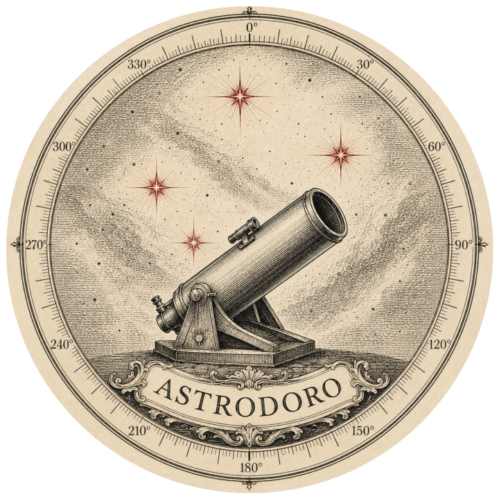

<p align="center">
  <picture>
    <source media="(prefers-color-scheme: dark)" srcset="assets/logo-dark.png">
    
  </picture>
</p>

# Astrodoro

Capture and live stacking for **electronically assisted astronomy** (EAA) on
macOS. It exists because there is no SharpCap equivalent on the Mac: you can
capture (AstroDMx, oaCapture) or live-stack from a watched folder (Siril, ASTAP,
ALS), but nothing does both in one loop.

It is built around a specific, awkward setup — a **Dobsonian on an equatorial
platform**, with no goto and no autoguiding — and most of the interesting design
decisions follow from that. A phone strapped to the tube is the only pointing
sensor; frame acceptance is judged relative to what the night is actually
delivering, not against absolute thresholds a different telescope would meet.

**Status:** working, with a graphical interface. It captures, calibrates,
detects stars, registers, stacks, displays with real-time autostretch, and saves.

**Camera:** SVBONY SV405CC. The architecture isolates the driver
(`astrodoro.drivers`), so porting another vendor means writing one module.

---

## Install

Requires Python 3.11+ and [uv](https://docs.astral.sh/uv/).

```bash
git clone https://github.com/mathmed/astrodoro
cd astrodoro
make setup          # uv sync, prepare the SDK, download the catalogue
```

`make setup` does three things:

| step | what it does |
| --- | --- |
| `uv sync --extra dev` | creates `.venv` with the runtime and dev dependencies |
| `make sdk` | copies and re-signs the SVBony arm64 dylib into `vendor/lib` |
| `make catalog` | downloads OpenNGC into `data/NGC.csv` (or `astrodoro catalog`) |

The SVBony SDK is not redistributable, so `scripts/setup_sdk.sh` takes it from a
local AstroDMx installation (the same SDK, v1.13.4). It also has to rewrite the
libusb path and re-sign the dylib — on arm64, modifying a dylib invalidates its
signature and dyld refuses to load it. Details are in the script.

**Without the camera** everything except live capture still runs: see
[Working without hardware](#working-without-hardware).

## Use

```bash
make gui            # or: astrodoro-gui
```

The interface is organised by **task mode**, not by settings category: each
phase of the night needs a different screen, and the mode rearranges both sides.
The first three modes are the phases of a night; the fourth holds what you set
once and then forget.

| mode | key | panel | in the place of the image |
| --- | --- | --- | --- |
| Frame | `1` | phone sensor, which star to align on, camera source | live frame; target direction and objects in the field below |
| Targets | `2` | hour, filters, target by name | the ranked list, with why each object scored what it did |
| Integrate | `3` | stretch, per-channel gain, gradient, stacking, dark, flat, recording | stack; histogram and residual rotation below |
| Config | `4` | folders, observing site, optics, language, display | full-width histogram |

Focusing is not a mode: the **loupe** (`Z`, or the button on the image bar) is a
5x view of a star that floats over the frame in any mode, with the HFR, the
session best and the beep. Focus is not a phase of the night — it is something
you redo whenever the temperature drifts, in the middle of whatever you were
doing. Click the image to pin the loupe to a particular star.

Other keys: `V` toggles stack/frame, `M` the sky map, `Z` the loupe, `F` image
only, `N` night mode, `L` the log, `space` marks a new segment, `Esc` leaves a
frame review, `Ctrl+S` saves what is on screen.

### Which star to align on

The sensor needs one star, and picking it is the step where people give up:
179 names in the dark, and aligning on the wrong star of a close pair gives a
confident, wrong position all night. Frame names one and offers to align on it,
weighing four things — bright, **unmistakable** (no similar star within a few
degrees), comfortable to reach (not at the zenith, where the Dobsonian is
awkward, nor at the wall), and **as close to the target as possible**, because
one star corrects two axes and its accuracy is local. Pick a target in Targets
and the answer changes: with M8 chosen it says Antares, 21° away. `↻` offers the
next one when the first is behind a tree, `☆` shows it on the sky map.

### What to image tonight

**Targets** answers the question a catalogue does not: of everything above the
horizon *at this hour*, what is worth pointing at. Each object is scored by six
things, and the panel beside the list shows all six so the ranking can be argued
with:

- **altitude** — atmospheric extinction, 0.25 mag per airmass, with a penalty
  above 80° where the Dobsonian is awkward and the azimuth unstable;
- **remaining window** — minutes left above your minimum altitude, against the
  ~45 minutes a useful run on one object takes;
- **the Moon** — its phase, its distance and its height, weighted per family: a
  gibbous Moon 40° away ruins a face-on galaxy and barely touches a globular;
- **size in the frame** — the comfortable band is 15%..70% of the short side
  (55'x37' with a 1200 mm and this sensor at bin2);
- **surface brightness** — not the integrated magnitude: M31 is magnitude 3.4
  and still a faint smudge, because that light is spread over half a degree;
- **whether anyone ever named it** — a catalogue does not record which objects
  are worth a night, and this is the closest thing to that fact in the data.
  Without it the first fifteen suggestions on a real evening were fifteen
  anonymous open clusters, high, small and moon-proof, and none of them is why
  anyone goes outside.

Each suggestion also shows **what it looks like**: a DSS survey cutout with your
own frame drawn on it, which answers "will it fit" faster than any pair of
numbers. Pictures are fetched once and kept on disk — there is no internet in
the field, so **cache the photos of this list** before going out, and untick
*show a photo of the object* if you would rather the program never touched the
network.

The hour is a field, not just "now": the decision is usually made at dusk, and
what matters is what will be well placed at eleven. Filter by type, magnitude,
minimum altitude and "only what fits in the frame"; double-click a row (or
`Enter`) to make it the target and land in Frame, where the arrow says which way
to push the tube.

### As a macOS app

Run from the terminal and macOS names the process after the interpreter, because
a bare Python process has no bundle to read a name from. To get a real app —
named Astrodoro in the Dock, the menu bar and the app switcher, with the icon:

```bash
make bundle          # build/Astrodoro.app
open build/Astrodoro.app
```

The bundle is generated, not committed: its launcher holds the absolute path of
your checkout's virtualenv. Activity Monitor still reports the interpreter, since
that is literally the process running — see
[assets/README.md](assets/README.md#naming).

### Command line

```bash
astrodoro dark  --exp 5 --gain 250 --frames 20 --target-temp -10
astrodoro flat  --exp 0.5 --gain 250 --dark ~/Astrodoro/darks/dark_g250....fits
astrodoro run   --exp 5 --gain 250 --dark ~/Astrodoro/darks/dark_g250....fits
astrodoro replay ~/Astrodoro/sessions/2026-08-18/2130_M8
astrodoro info | usb | bench | tec | sensor
astrodoro catalog                  # download the deep-sky catalogue
astrodoro settings --set capture_dir /Volumes/data/astro
```

`make` with no target lists every shortcut.

## Where files go

Nothing is written into the repository. By default:

```
~/Astrodoro/sessions/YYYY-MM-DD/HHMM_target/
    subs/sub_00001.fits ...   RICE-compressed raw subs
    session.json              settings, target, statistics
    stack.fits, stack_final.fits, previews
~/Astrodoro/darks/  ~/Astrodoro/flats/  ~/Astrodoro/exports/
```

All four folders are configurable — **Config → folders** in the GUI, or
`astrodoro settings --set capture_dir ...`. Settings live in a JSON file outside
the project (`~/Library/Application Support/astrodoro/settings.json` on macOS);
`astrodoro settings` prints the path and every value.

## Language

The interface ships in **English** and **Brazilian Portuguese**, switchable in
**Config → display** (or `astrodoro --lang pt_BR`). Adding a language means
copying one `.po` file and translating it — no build step, no system gettext.
See [CONTRIBUTING.md](CONTRIBUTING.md#translations).

## Working without hardware

This is the normal development path, and the reason the abstractions exist.

**No camera.** `ReplaySource` plays back the FITS subs of a recorded session,
honouring each frame's metadata, so the pipeline behaves exactly as it did on
the night of capture. Pick "replay" as the source in the GUI, or:

```bash
astrodoro replay ~/Astrodoro/sessions/2026-08-18/2130_M8
```

In the GUI the replay has a speed control (default 4x) and a loop toggle. Prefer
replay to mocks — it exercises the real code with real data.

**No phone.** `scripts/fake_handset.py` connects a fake device to the GUI's
sensor server, crooked mount included — that twist is what makes the alignment
most accurate near the star used.

```bash
make gui        # in one terminal, with the sensor switched on
make handset    # in another
```

## Architecture

```
src/astrodoro/
├── core/         frame pipeline: calibration → stars → registration → stacking,
│                 plus the target ranking (tonight.py)
├── pointing/     where the tube points: phone server, orientation, sky data
├── drivers/      camera drivers (svbony); nothing above here talks to an SDK
├── ui/           Qt interface: window, capture thread, design system, sky map
├── cli/          headless commands
├── i18n/         translation catalogues
└── settings.py   user settings, shared by the GUI and the CLI
```

**Per-frame pipeline.** `FrameSource` → `calibration.calibrate` →
debayer/luminance → `stars.detect` → `register.estimate` → `LiveStacker.add` →
`stretch` for display → `Recorder`.

**Two front ends, one core.** `astrodoro.ui` (window plus a capture thread that
emits Qt signals) and `astrodoro.cli`. Both call the same `core`, and
calibration in particular lives in exactly one function so the two cannot drift
apart.

The decisions that are easy to "simplify" back into a bug — why the registration
reference is the accumulated stack, why acceptance is a relative weight, why one
alignment star is enough — are written up in
[docs/design-notes.md](docs/design-notes.md), with the measurements behind them.

## Hardware notes

[docs/hardware.md](docs/hardware.md) documents nine **measured** traps in this
camera, each able to corrupt a stack silently. Read it before touching
`drivers/` or calibration. The costliest:

- RAW16 arrives with the 14 bits shifted 2 left (scale 0..65532) — use
  `Camera.full_scale`;
- the SDK applies white balance to RAW data and enables hot pixel correction —
  `_force_linear()` undoes both;
- gain is locked while exposure is on auto, and the SDK persists that state to
  disk between sessions;
- **bin3/bin4 clip the highlights — use bin2**; and binning does not speed
  anything up.

## No plate solving

There used to be a plate solver (a wrapper over astrometry.net and ASTAP) and it
was removed deliberately: a blind search takes minutes and is no use for finding
a target, which is what this screen is for. The phone sensor answers where the
tube points. Two consequences remain: `core/polar.py` is still correct but has
no position source in the interface, and object annotation over the image went
with it — with no WCS there is no field orientation. In its place, the context
panel lists what falls inside a circle the size of the frame.

## Contributing

Bug reports, measurements and patches are welcome — especially from anyone with
different hardware. Start with [CONTRIBUTING.md](CONTRIBUTING.md).

## Licence

GPL-3.0-or-later. See [LICENSE](LICENSE) and
[docs/third-party.md](docs/third-party.md) for the embedded data and the
projects this one learned from.
